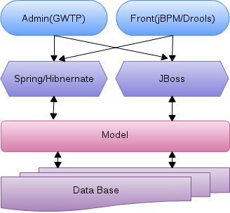

# What is jcommerce

jcommerce is traditional Java EE application, Use both Spring and JBoss implmentation to interact with database like Oracle, Mysql, GWTP based admin and front selectively use either Spring implementaion, or JBoss implementation.

jcommerce first registed on sourceforge at 2003-04-29, [the original jcommerce on sourceforge](https://sourceforge.net/projects/jcommerce/)

# About jcommerce

* GWTP based front-end 
* Either Spring, or JBoss based back-end
* jBPM and drools enable
* Red Hat Paas OpenShift enable
* Mobile enable

# Download

[jcommerce 0.8.alpha download](https://sourceforge.net/projects/jcommerce-dist/files/jcommerce/0.8.alpha/), [Realse Notes](./dist/0.8.alpha/README)
